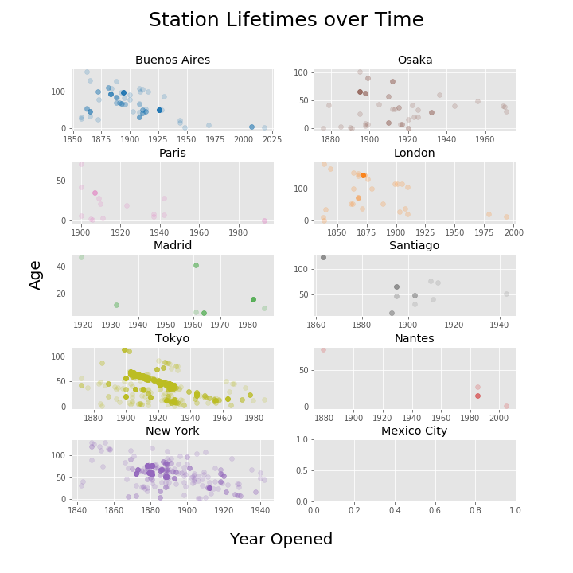

# Background
As affectionados of travel and pent-up covid demand, we decided to evaluate the Transit Lines database found as part of our case study completed on May 21st, 2021.

# Data
This historical and international dataset documents how transit lines have evolved all over the world. Besides time, number of lines, and line length, the dataset contains spatial locations that could be mapped using a geospatial library in Python like GeoPandas or Folium.

The dataset is more fully described on Kaggle, and can be found [here](https://www.kaggle.com/citylines/city-lines).

# Exploratory Data Analysis

After importing and cleaning our data using **pandas**, each team member 

# Station Lifetimes

One of the main questions that we had was to determine the typical lifespan of a station in each area. While the majority of the stations are still in use, quite a sizable number of stations have closed over the years due to a lack of funding, improvements or migration. To answer this, the 
The 

