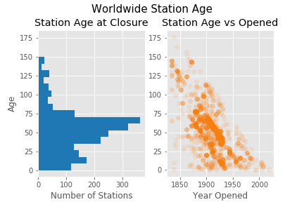
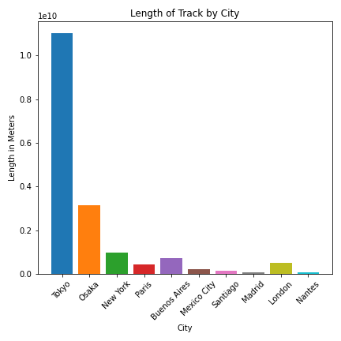

# Background
As affectionados of travel and pent-up covid demand, we decided to evaluate the Transit Lines database found as part of our case study completed on May 21st, 2021.

# Data
This historical and international dataset documents how transit lines have evolved all over the world. Besides time, number of lines, and line length, the dataset contains spatial locations that could be mapped using a geospatial library in Python like GeoPandas or Folium.

The dataset is more fully described on Kaggle, and can be found [here](https://www.kaggle.com/citylines/city-lines).

# Questions 
Some questions we decided to tackle include but are not limited to:
    -What are the cities with the most stations?    
    -Of said cities, how long is the shelf life of a station?
    -What is the average tracklength for said cities?
    -How prolific are cities at building train stations?

# Caveat 
This dataset is partly historical, and thus is missing a lot of values for certain earlier time periods. So, take these evalautions with a grain of salt :)

# Station Lifetimes

One of the main questions that we had was to determine the typical lifespan of a station in each city. While the majority of the stations are still in use, a sizable number of stations have closed over the years due to a lack of funding, improvements or migration. To answer this, we initially plotted all the station closures throughout the world in relation to station age frequency and opening date. There appears to be a sharp drop off in station closure age after 65-75 range, which should be expected considering the age and usage. What was surprising was how many units were clustered between 40-60. 

Investigating further, the stations that were closed were mostly built around the turn of the ~1900-1930s. Historically, this makes sense with a lot of the rebuilding that occurred as a result of the world wars and explosive booms. The stations were retired after a median 54 years, with 75% of the stations closing by 1972. By this time, the cars and airplanes emerged as alternative options to public transit and aligns historically. There appears to be a slight inverse linear correlation with the age of the station with the year it opened.

Diving a bit deeper into the station age, we decided to focus into the top cities that had the most open stations currently. With the number of stations being built, we would expect a sizable turnover of stations with the median turnover age. However what was surprising was how few stations were closed in the cities and when was how long ago the last year were closed. This suggests that the stations were retrofitted and continued for use. Tokyo and New York had a large turnover in the early 1900s.

# Station Building

It comes as no surprise that the city with the most stations in the world also has the highest rate of station building.

 Working primarily with the stations tables I paid most attention to the date and location they were opened. I found that cities with existing subways tend not to be focused on building new ones except for Tokyo, who with such a large amount of stations, seem to be constantly building new ones as old ones break down. 

Also, in the 1950s with the advent of new forms of travel we can see these cities temporarily stopped opening new stations before building them up again. Bordeaux is an anomaly in that the other cities displayed here are very high in population with metros that have existed for around a hundred years while Bordeaux’s relatively small population is served by a much larger metro. You can see their first station was opened in 2003 and then they really started going ham in the following years.

I also found a lot of data relating to the opening and closing of stations missing when it came to
'Munich' 'Boston' and 'Shanghai' so I did not graph them.

# Length of Tracks

It would make sense that the cities with the highest densities of station building over time would have the longest overall tracks. Looking at the graphs above and at the graph below there appears to be a correlation. Tokyo and Osaka have the longest Tracks.

